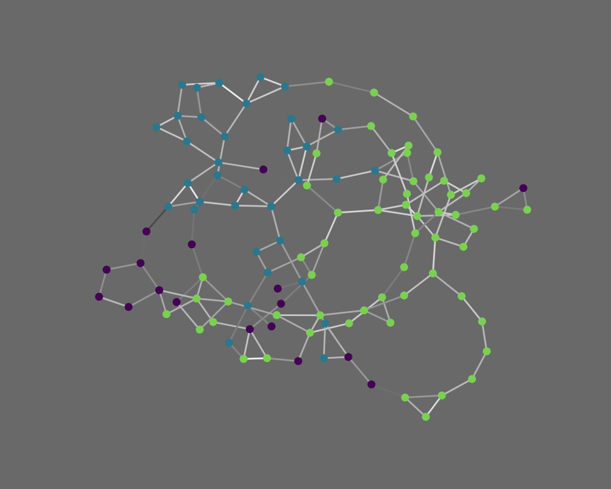
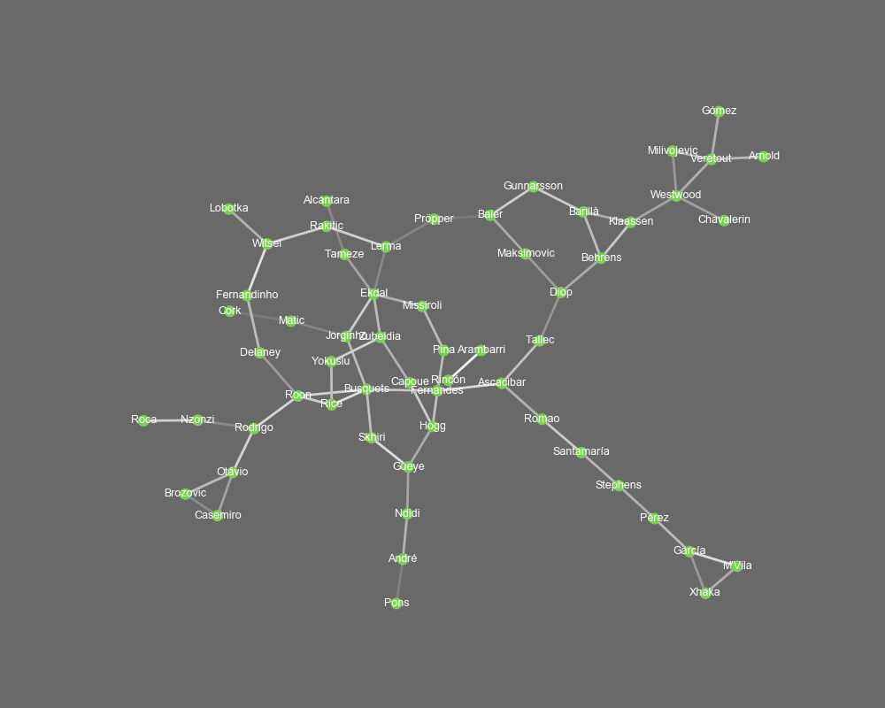

# player-networks

## Data-driven method for identifying similar players

This repository contains code and a description for the computation of Player Similarity Networks. Given a set of statistics for a set of players, we use Nearest Neighbors and DBSCAN in order to detect similar players and player clusters.  

A detailled documentation of the method can be found in the PDF file.

## Code
The main file is  `pn_main.py`. and see the instructions at the beginning. It needs a `DataFrame` `X` as input in which each row contains the statistics of one player. The index of the `DataFrame` should be the player names.  

A Graph object `G` is then derived. The standard metric we used is `cosine`. The number of neighbors for each player can be specified by `k`. See the PDF for more details.  

Below you see the result for a dataset of central midfielders of the season 2018/19. 

Complete network: 

Cluster 1: 

## Interpretation of the network
Players that are connected by an edge are similar in playing style. The edge color represents the strength of the connection. The whiter an edge, the more similar are the players.  

Node color encodes a players' cluster. Purple nodes are what DBSCAN detects as noise, i.e. players with few or no similar players in the sample.
